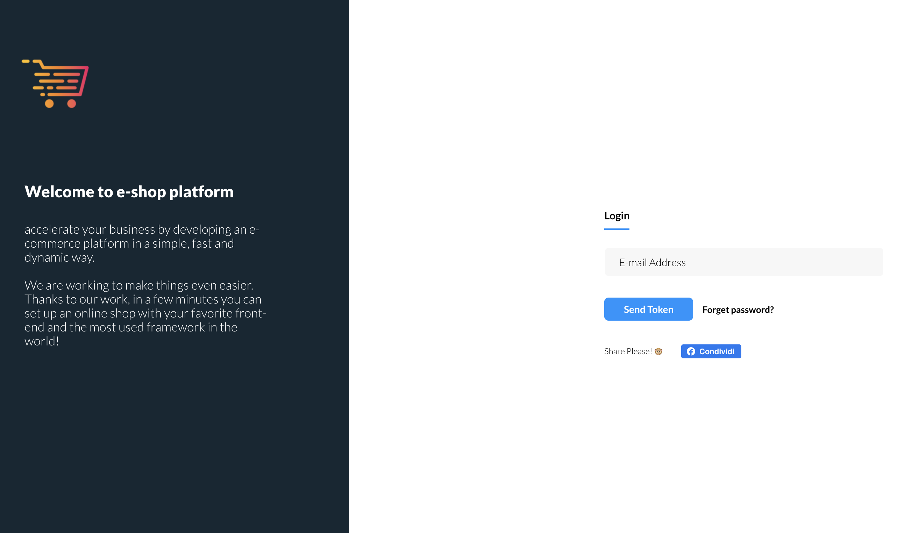

## About e-shop Package 🐣 ([Demo](https://mwspace.com/store))

Let's say I want to turn my simple site made with laravel into a shop.

How many steps should I follow to configure the entire Shop with the modem and controllers from scratch?

I should start writing the classes for the models in the database, the migrations, the keys, populate the database, create a login for admin, migrate the tables, start creating all the calls from the routes to the controllers to insert products, insert categories, insert payments etcetera etcetera.

But if I have already done the website and just want to turn it from Statico to an actual Shop how can I do?

simple, launching a command: 

    composer require mwspace/e-shop

Here magically my laravel application becomes a powerful ecommerce! Now I just have to load my products and make the site pages dynamic so that they take the products from the database.

preconfigured with stripe, you'll be ready to make money with your Front End!

## Contributing 🐙

Thank you for considering contributing to the e-shop Laravel Package framework!

## Security Vulnerabilities 🦑

If you discover a security vulnerability within Laravel, please send an e-mail to Support via [e-shop@mwspace.com](mailto:e-shop@mwspace.com). All security vulnerabilities will be promptly addressed.

## License 🦐

The Laravel framework is open-sourced software licensed under the [MIT license](https://opensource.org/licenses/MIT).
